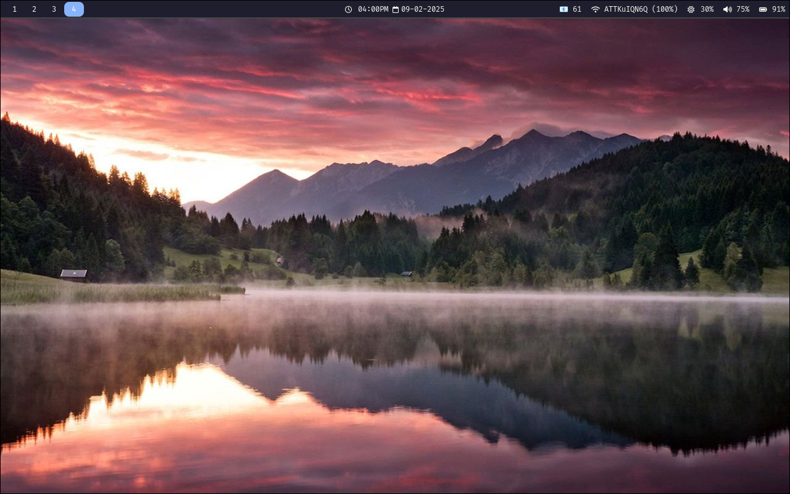
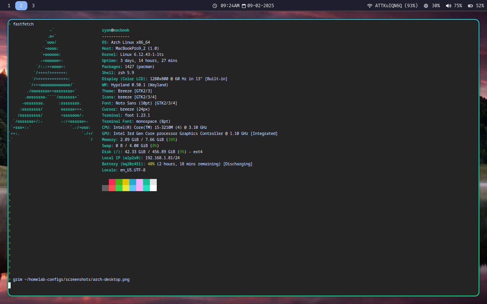

# Arch Linux on 2012 MacBook

## Overview
This project demonstrates a full installation and configuration of Arch Linux on a legacy 2012 MacBook.  
The laptop could not run the latest macOS, so this setup required hardware troubleshooting, performance optimization, and a fully manual Linux installation.  
The goal was to create a lightweight, stable, and productive system on older hardware.

## Contents
```text
|---macbook-arch-install/
    |---config/
        |---waybar_config.jsonc		//config file used for customization of waybar (taskbar tool for hyprland)
        |---foot.ini			//config file used for foot, my terminal of choice
        |---hyprland.conf		//config file used for hyprland, a unique and lightweight desktop environment that is usually navigated with keybinds
        |---style.css 			//style file used for stylization of the waybar
    |---README.md
    |---screenshots/
        |---terminal.png		//screenshot of my foot terminal running Zsh w/ Powerlevel10k theme, and fastfetch
        |---hyprland.png		//screenshot of what my waybar/hyprland desktop environment look like without any windows open
    |---scripts/
        |---brightness.sh		//script that is run in waybar_config.jsonc, used to show and modify current screen brightness levels from the desktop
        |---gmail-unread.py		//script that is run in waybar_config.jsonc, used to scrape google for unread email numbers, displays it on waybar, and provides a direct link to my gmail account
        |---auto-update.sh 		//script used for automatically searching for updates through pacman and AUR, run with cron once a week
```

## Setup Process
1. Installed Arch Linux on the MacBook, including partitioning and bootloader configuration  
2. Configured networking, locale, and keyboard layouts for optimal usability  
3. Installed and configured Xorg and the Hyprland window manager for a modern, minimal desktop experience  
4. Set up Zsh with Powerlevel10k for a productive shell environment  
5. Installed and configured essential packages for development, media, and system monitoring  
6. Optimized performance for legacy hardware, including CPU, GPU, and memory tweaks  

## Key Configurations

| Area                     | Description                                                               |
|--------------------------|---------------------------------------------------------------------------|
| Window Manager           | Hyprland configured for efficiency and visual appeal                      |
| Shell & Prompt           | Zsh with Powerlevel10k theme, custom aliases, and productivity shortcuts  |
| System Monitoring        | htop, neofetch, and other tools for real-time system performance tracking |
| Networking               | Configured Wi-Fi, firewall, and LAN settings for stability and security   |
| Performance Optimization | Tweaks for CPU scaling, memory usage, and GPU support for legacy MacBook  |
| Automation               | Bash scripts for system updates and maintenance tasks                     |

## 'hyprland.conf' snippet
monitor=1,1920x1200,0x0,1
bind=SUPER+ENTER,exec,foot

## Automated Updates Script 'update.sh'
#!/bin/bash
sudo pacman -Syu --noconfirm
yay -Syu --noconfirm
sudo pacman -Rns $(pacman -Qdtq) --noconfirm

# Challenges & Solutions
-- **Legacy Hardware:** MacBook was no longer supported by latest macOS, so I configured a lightweight Linux setup
-- **GPU/Driver Issues:** Manually installed and configured drivers for stable graphics performance
-- **Package Dependencies:** Used Pacman and AUR helpers to resolve complex package conflicts
-- **System Performance:** Tuned CPU scaling, memory usage, and startup services for faster boot and responsiveness
-- **Power Consumption:** MacBook previously was not able to run off the charger, now holds 3.6 hours of battery life through optimized power consumption

## Results
-- Fully functional and visually appealing Linux desktop on a legacy MacBook
-- Lightweight setup optimized for performance and usability
-- Fully automated maintenance with update scripts
-- Stable environment for development, daily tasks, and personal projects

## Skills Demonstrated
-- Manual installation and configuration of Arch Linux on legacy hardware
-- Desktop environment setup and window manager configuration (Hyprland)
-- Shell customization and productivity with zsh and Powerlevel10k
-- Performance tuning for older laptops (CPU, memory, GPU)
-- Package management with Packman and AUR
-- System monitoring and troubleshooting
-- Bash scripting and automation for updates and maintenance

## Desktop/Terminal Example



