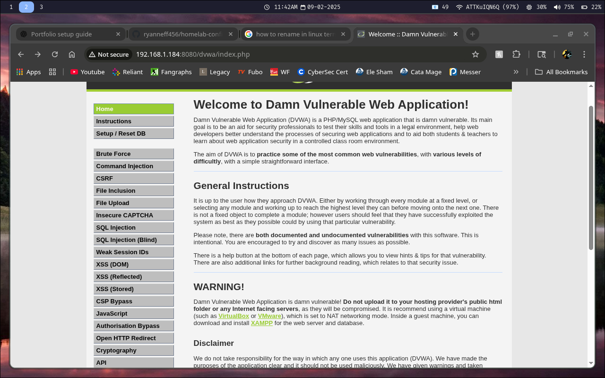
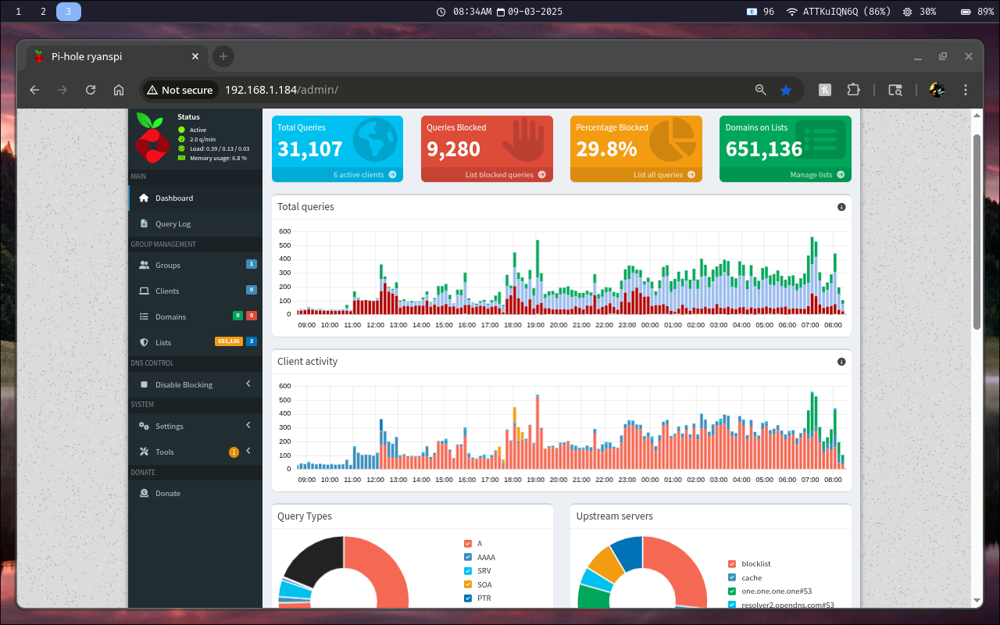
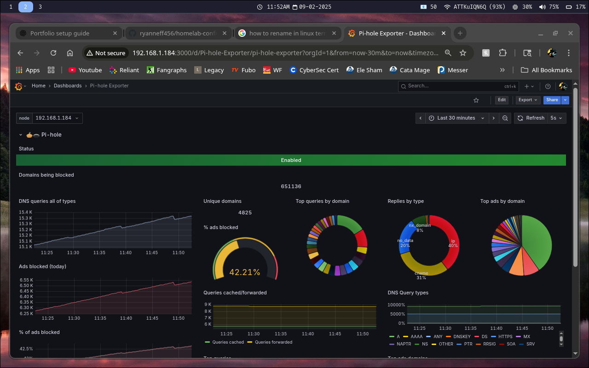
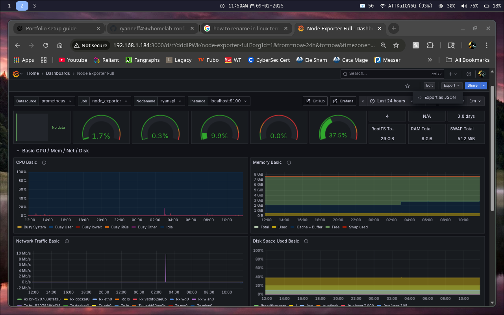

# Raspberry Pi Home Server

## Overview
I configured a Raspberry Pi 4 to act as a lightweight home server.  
It runs several essential services for networking, storage, and system monitoring, all installed and configured manually.  
This project demonstrates skills in Linux system administration, networking, automation, and remote management.

## Contents
Table of contents and additional information of each subfolder
```text
|---raspberry-pi-server
    |---config/
        |---dvwa_config.inc.php 		    //configuration file for my DVWA webpage used for pentesting
        |---grafana.ini 			        //config used for hosting the grafana web UI, used for dashboards
        |---pihole.toml 			        //config used for setting up and hosting the pihole web UI
        |---wg0.conf	 			        //config used for setting up Wireguard VPN
    |---grafana/
        |---dashboards
            |---pihole_dashboard.json		//configuration file used for the pihole Grafana dashboard
            |---raspberrypi_dashboard.json 	//configuration file used for general monitoring of the Raspberry Pi device 
    |---README.md
    |---screenshots/
        |---dvwa.png				        //screenshot of the DVWA home page
        |---pihole_dashboard.png		    //screenshot of the dashboard on the PiHole home page
        |---pihole_graf_dashboard.png		//screenshot of the Grafana dashboard for PiHole data
        |---raspberrypi_graf_dashboard.png	//screenshot of the Grafana dashboard for data on the Raspberry Pi itself
    |---scripts/
        |---daily-update.log			    //log file that stores printed messages from daily-update.sh
        |---daily-update.sh			        //automated update script that uses cron to run every day at 3AM, printing a message into daily-update.log 
```

## Setup Process
1. Installed Raspberry Pi OS Lite for a minimal, headless environment  
2. Configured a static IP for network stability  
3. Enabled SSH with key-based authentication for secure remote administration  
4. Installed and configured services manually:
   - **Pi-hole** for network-wide ad blocking and DNS filtering  
   - **Nextcloud** for personal cloud storage  
   - **WireGuard VPN** for secure remote access  
   - **Grafana** for system performance monitoring  
   - **DVWA** for safe web application testing from the LAN
5. Created a **bash script for automated updates** to keep the system secure and up to date  

## Services Deployed

| Service           | Purpose                                         | Installation Method                          |
|-------------------|-------------------------------------------------|----------------------------------------------|
| Pi-hole           | Network-wide ad blocking and DNS filtering      | Installed via official script                |
| Nextcloud         | Personal cloud storage                          | Installed manually with Apache + PHP + MySQL |
| WireGuard VPN     | Secure remote access                            | Installed via apt and configured manually    |
| Grafana           | System monitoring                               | Installed from repository packages           |
| DVWA              | Vulnerable web app for pentesting               | Installed manually with Apache + PHP + MySQL | 
| Automated Updates | Keeps system and services updated automatically | Custom bash script run via cron              |

---

## Example Configuration

### Bash Script for Automated Updates (`update.sh`)
'''bash
#!/bin/bash
# Update package lists and upgrade packages
sudo apt update && sudo apt -y upgrade
# Clean up unnecessary packages
sudo apt -y autoremove

This script runs automatically via cron to maintain system security and stability

## Challenges & Solutions
-- DNS Conflicts: ISP router was also serving DNS. Disabled router DHCP to allow Pi-hole to serve as the default DNS and DHCP server in the LAN.
-- Storage limitations: Attatched 1 TB external HDD for Nextcloud files
-- Remote acces: Configured WireGuard with key-based authentication for secure VPN access
-- Monitoring: Installed Grafana and Node Exporter to track CPU, memory, and network usage

## Results
-- Pi-hole filters ads and trackers across the entire home network
-- Nextcloud provides reliable personal cloud storage across devices
-- WireGuard VPN allows secure access to the home network from anywhere
-- Grafana dashboards provide insight into system performance
-- Automated updates ensure the system remains secure with minimal maintenance

## Skills Demonstrated
-- Manual Linux system setup and service installation
-- Networking configuration and DNS management
-- VPN setup with WireGuard for secure remote access
-- System monitoring with Grafana dashboards
-- Bash scripting for automation of updates
-- Remote administration via SSH
-- Troubleshooting service conflicts and resource limitations

## Example Screenshots

DVWA Web Page


Pi Hole Web UI Dashboard


Grafana Dashboard for Pi Hole


Grafana Dashboard for Raspberry Pi

